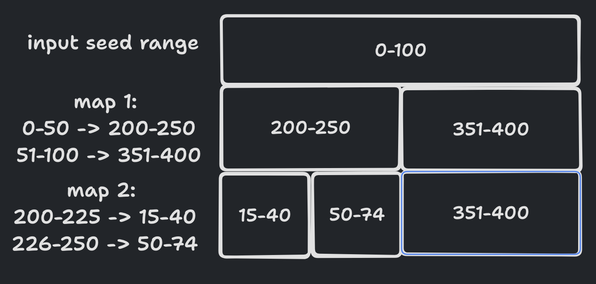

# Day 5
### Part 1
This wasn't too bad, I took a bit of time thinking about the data structure, my initial intuition was to build an
actual go map for all the values in the range but looking at the actual puzzle input that would be crazy.

I instead store each as a range with a function to convert a given number. Relatively easy.

### Part 2
I spent some time on this. My first attempt was to just go through all possible values, this wasn't actually too bad
but ages to run ~10 mins. I then got it down to ~1 min with go routines, but I still wasn't happy.

I thought about it for a bit and came back with a better idea, but it was much more complicated. You can see it in
the `part2` package. In there I'm trying to keep track of all the range boundaries, then keep putting the previous
set of boundaries into the next map layer. This is my mental image of what this is doing:

Keeping track of how each value maps in the next layer, but this way it only needs to keep track of the boundaries,
instead of searching through every value. This felt pretty close to working (it worked on the example) but failed on
the actual puzzle, it was very tricky to debug, so I left it.

I instead came back a bit later, realising I could probably just search the mapping backwards. All the time was being 
spent going through each of the seed values because it's having to look through billions of possible values, because I
already knew the answer was only a few 10's of million I could instead search through the map backwards starting at 0,
this gave the answer in 10s. I probably wouldn't have tried this had I not know the answer already, and the specific
input could make this solution intractable but honestly at this point I'd spent too long on this day.